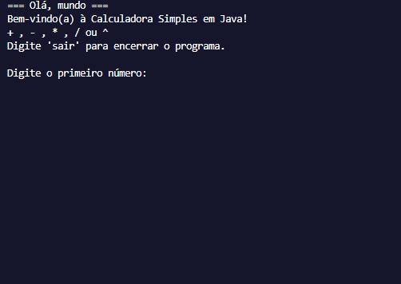

# 📘 Lista de Exercícios de Algoritmos

Repositório focado no desenvolvimento de raciocínio lógico, abrangendo estruturas condicionais, operações matemáticas e validação de dados.

---

## 🚀 Exercícios

<table width="100%">
  <tr>
    <td width="50%">
      <h3>01. Maior, Menor e Média</h3>
      
Lê três números informados pelo usuário e exibe qual é o maior, qual é o menor e realiza o cálculo da média aritmética entre eles.

    </td>
    <td width="50%">
      
    </td>
  </tr>
</table>

<table width="100%">
  <tr>
    <td width="50%">
      <h3>02. Máquina de Vendas (Troco)</h3>
      
Lê o valor de uma compra e o valor pago. O sistema verifica se o pagamento é suficiente e calcula o troco, otimizando a entrega com o menor número de notas possível.

    </td>
    <td width="50%">
      
    </td>
  </tr>
</table>

<table width="100%">
  <tr>
    <td width="50%">
      <h3>03. Equação do Segundo Grau</h3>
      
Resolve equações do tipo ax² + bx + c = 0. O programa calcula o discriminante (Δ), encontra as raízes e trata todos os casos possíveis (raízes reais ou inexistentes).

    </td>
    <td width="50%">
      
    </td>
  </tr>
</table>

<table width="100%">
  <tr>
    <td width="50%">
      <h3>04. Círculo e Esfera</h3>
      
Oferece opções de cálculo baseadas no raio: <b>Perímetro</b> do círculo, <b>Área</b> da superfície ou <b>Volume</b> da esfera.

    </td>
    <td width="50%">
      
    </td>
  </tr>
</table>

<table width="100%">
  <tr>
    <td width="50%">
      <h3>05. Calculadora Multifuncional</h3>
      
Uma calculadora completa que realiza operações de soma, subtração, multiplicação, divisão e cálculos de potência.

    </td>
    <td width="50%">
      
    </td>
  </tr>
</table>

<table width="100%">
  <tr>
    <td width="50%">
      <h3>06. Sorteio Aleatório</h3>
      
Lê dois números limites, gera um valor aleatório dentro desse intervalo e informa ao usuário se o número sorteado é par ou ímpar.

    </td>
    <td width="50%">
      
    </td>
  </tr>
</table>

---

## 🛠️ Tecnologias
* **Linguagem:** Java
* **JDK:** Versão 11 ou superior
* **IDE Sugerida:** IntelliJ IDEA / VS Code / Eclipse
